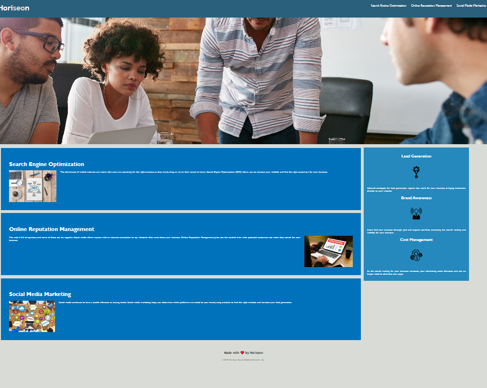

# Challenge1
Challenge 1 - HTML, CSS and Git Assesment
The challenge required the html code and CSS to be reviewed and to improve on the code, factoring in issues like accessibiltiy and best practices. 

## Mockup
The following image shows the web application's appearance and functionality:

